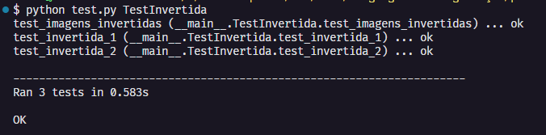
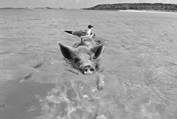

# Questões [[1](#qt1), [2](#qt2), [3](#qt3), [4](#qt4), [5](#qt5)]

**<a id="qt1">QUESTÃO 01 - Pág. 07</a>**: Se você passar essa imagem pelo filtro de inversão, qual seria o
output esperado? Justifique sua resposta

```
Cada pixel da Imagem deve está invertido, por exemplo se o pixel na posição 2 do vetor pixels tiver o valor 3, então o seu inverso será 255 - 3 = 252, algo que estava próximo da cor preto agora está próximo da cor branca, e assim para cada pixel da imagem
```

---

**<a id="qt2">QUESTÃO 02 - Pág. 08</a>**: Faça a depuração e, quando terminar, seu código deve conseguir
passar em todos os testes do grupo de teste TestInvertida (incluindo especi-
ficamente o que você acabou de criar). Execute seu filtro de inversão na imagem
test_images/bluegill.png, salve o resultado como uma imagem PNG e
salve a imagem.

- Terminal executando os testes:

  

- Imagem Invertida:

  

---

**<a id="qt3">QUESTÃO 03 - Pág. 09</a>**: Considere uma etapa de correlacionar uma imagem com o seguinte
kernel:

|       | Kernel |       |  -  |     |           Amostra            |     |
| :---: | :----: | :---: | :-: | :-: | :--------------------------: | :-: |
| 0.00  | -0.07  | 0.00  |  -  | 80  |              53              | 99  |
| -0.45 |  1.20  | -0.25 |  -  | 129 | <i style="color:red">127</i> | 148 |
| 0.00  | -0.12  | 0.00  |  -  | 175 |             174              | 193 |

Qual será o valor do pixel na imagem de saída no local indicado pelo destaque vermelho? Observe que neste ponto ainda não arredondamos ou recortamos o valor, informe exatamente como você calculou. Observação: demonstre passo a passo
os cálculos realizados.

```
O(x,y) = I(x−1,y−1)×k(0,0) + I(x,y−1)×k(1,0) + I(x+1,y−1)×k(2,0) +
I(x−1,y)×k(0,1) + I(x,y)×k(1,1) + I(x+1,y)×k(2,1) +
I(x−1,y+1)×k(0,2) + I(x,y+1)×k(1,2) + I(x+1,y+1)×k(2,2)

O(x,y) = 80×0 + 53×(-0.07) + 99×0 +
129×(-0.45) + 127×1.20 + 148×(-0.25) +
175×0 + 174×(-0.12) + 193×0

O(x,y) = 0 + (-3.710) + 0 +
(-58.050) + 152.400 + (-37) +
0 + (-20.880) + 0

Resultado: O(x,y) = 32.76
```

---

**<a id="qt4">QUESTÃO 04 - Pág. 12</a>**: Quando você tiver implementado seu código, tente executá-lo em
test_images/pigbird.png com o seguinte kernel 9 × 9:

- Kernel:
  | | | | | | | | | |
  | :-: | :-: | :-: | :-: | :----: | :-: | :-: | :-: | :-: |
  | 0 | 0 | 0 | 0 | 0 | 0 | 0 | 0 | 0 |
  | 0 | 0 | 0 | 0 | 0 | 0 | 0 | 0 | 0 |
  | 1 | 0 | 0 | 0 | 0 | 0 | 0 | 0 | 0 |
  | 0 | 0 | 0 | 0 | 0 | 0 | 0 | 0 | 0 |
  | 0 | 0 | 0 | 0 | 0 | 0 | 0 | 0 | 0 |
  | 0 | 0 | 0 | 0 | 0 | 0 | 0 | 0 | 0 |
  | 0 | 0 | 0 | 0 | 0 | 0 | 0 | 0 | 0 |
  | 0 | 0 | 0 | 0 | 0 | 0 | 0 | 0 | 0 |
  | 0 | 0 | 0 | 0 | 0 | 0 | 0 | 0 | 0 |

- Imagem gerada:

  

---

**<a id="qt5">QUESTÃO 05</a>**:
